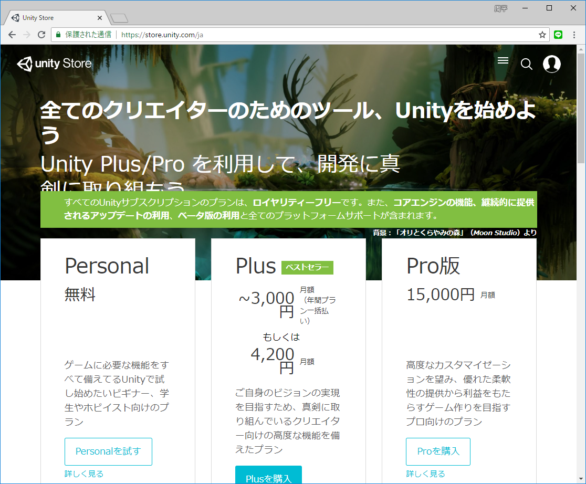
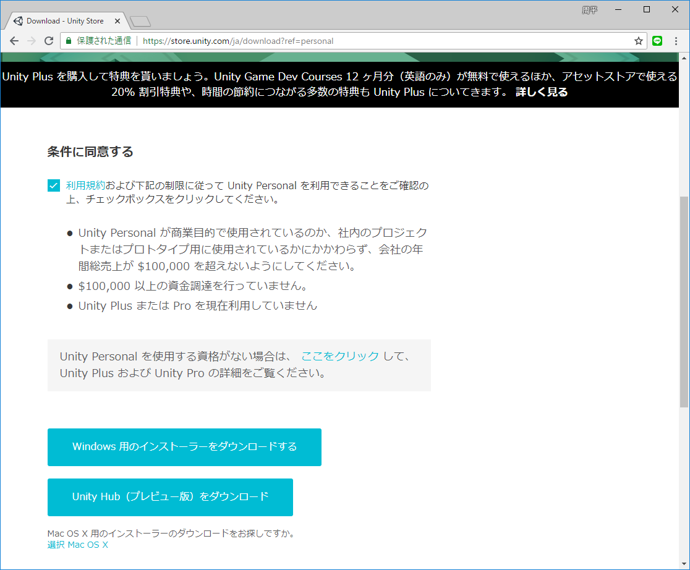
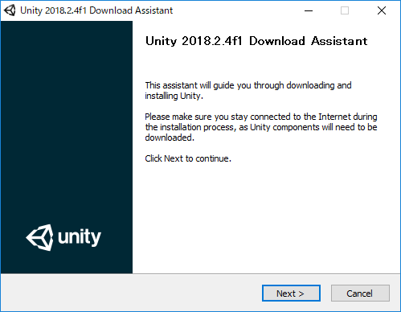
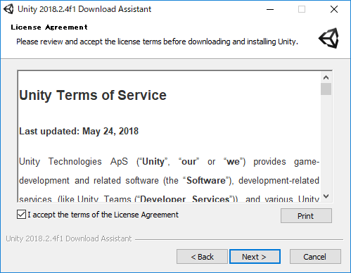
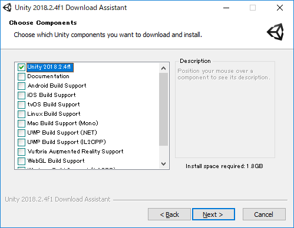
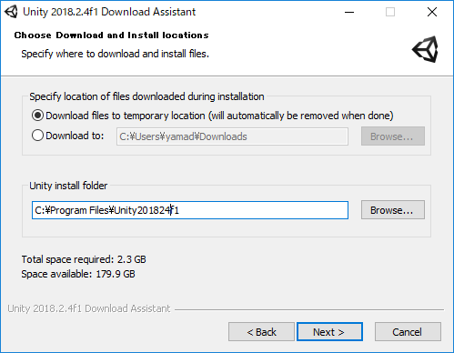
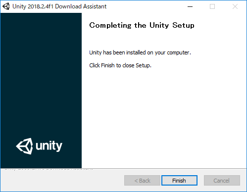
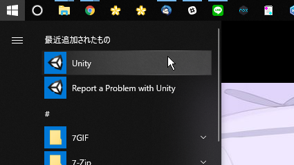
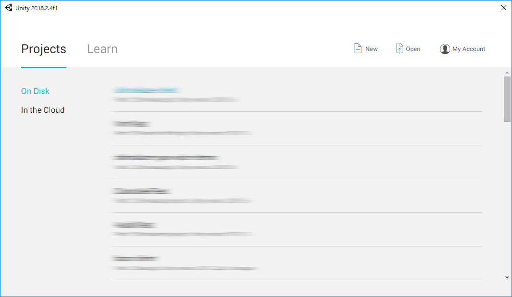

<!-- $theme: gaia -->

# Unityのインストール

---

## Unityのインストール
- まずはダウンロード
- https://store.unity.com/ja
- Personalを選択

---

## Unityのインストール
- 条件を確認してダウンロード

---

## Unityのインストール
- Nextを選択

---

## Unityのインストール
- Nextを選択

---

## Unityのインストール
- Nextを選択
- UnityとVisualStudio（MacだとVisualStudioCode）にチェックが入っているか確認

---

## Unityのインストール
- Finish

---

## Unityのインストール
- Nextを選択

---

## Unityのインストール
- 起動！

---

## Unityのインストール
- 起動後

